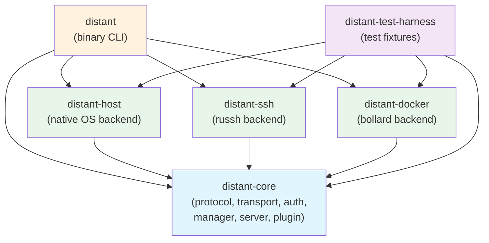
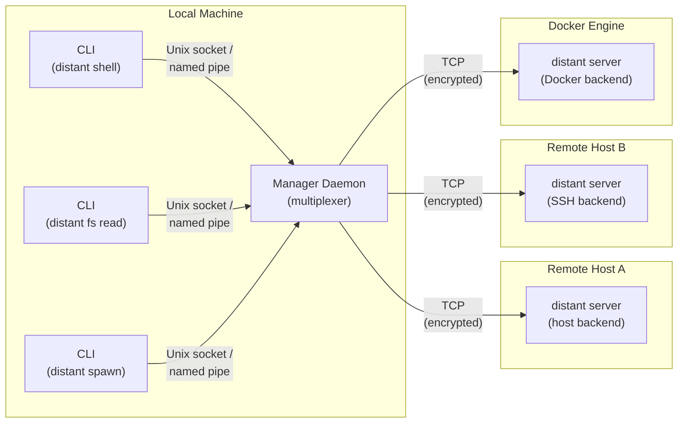
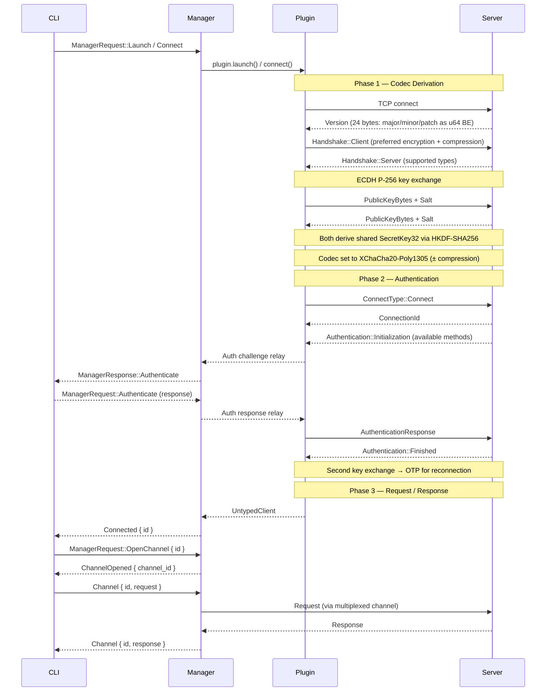
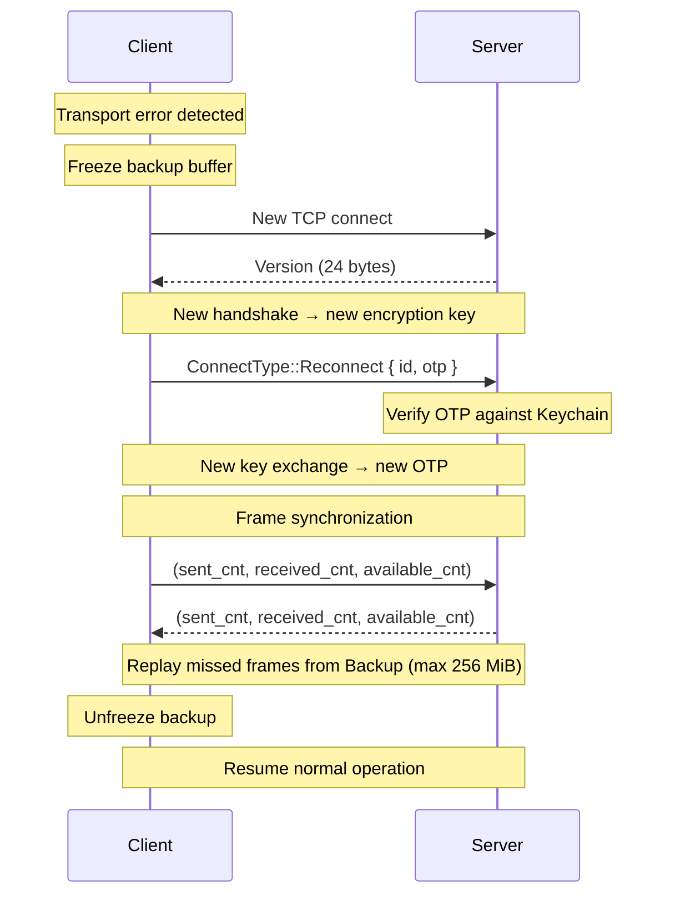
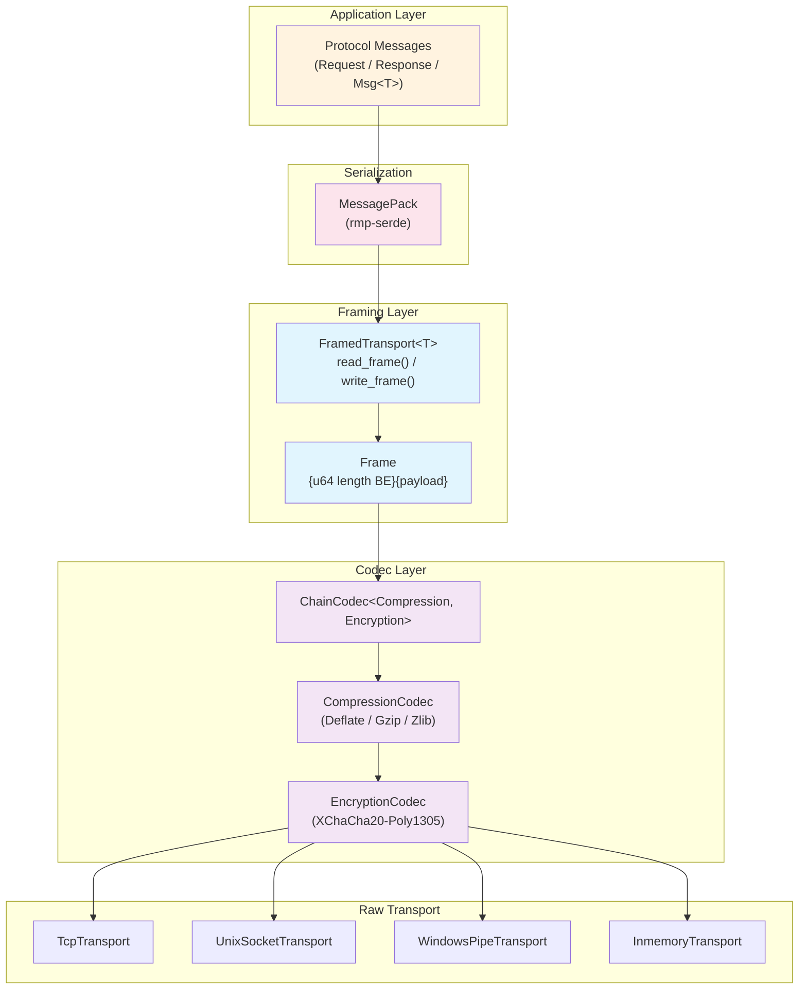
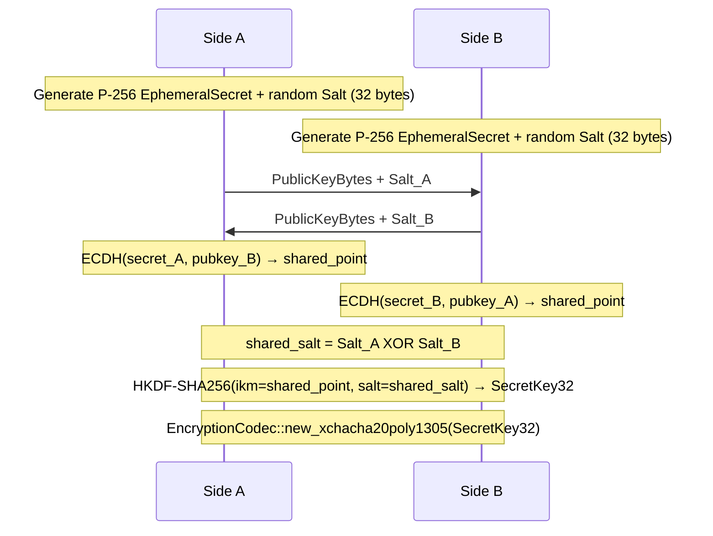
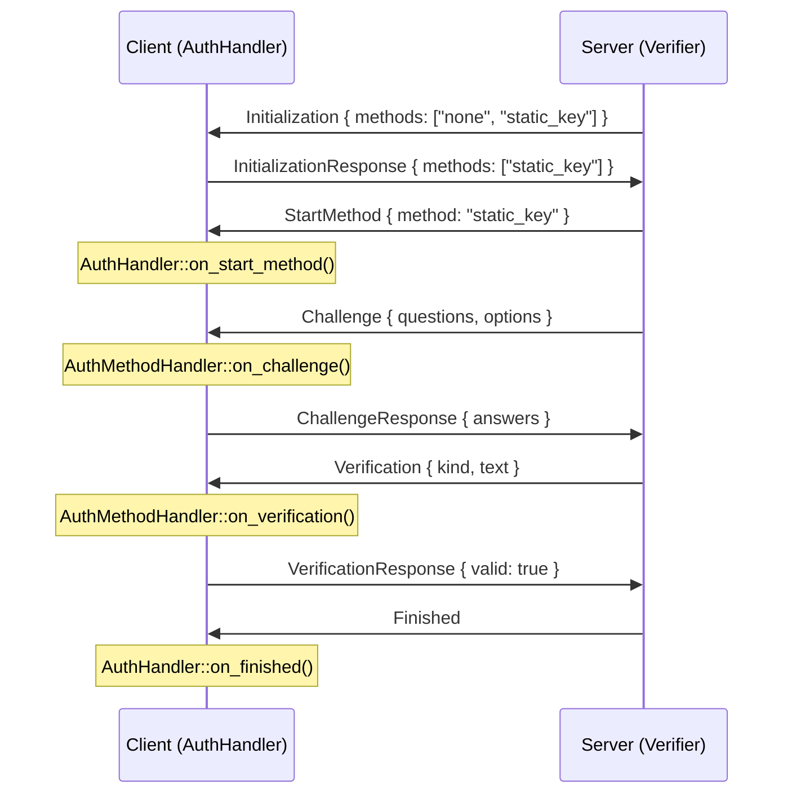
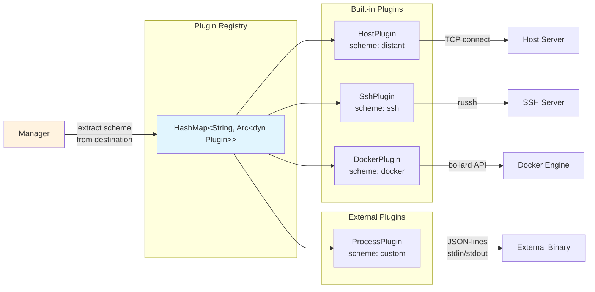
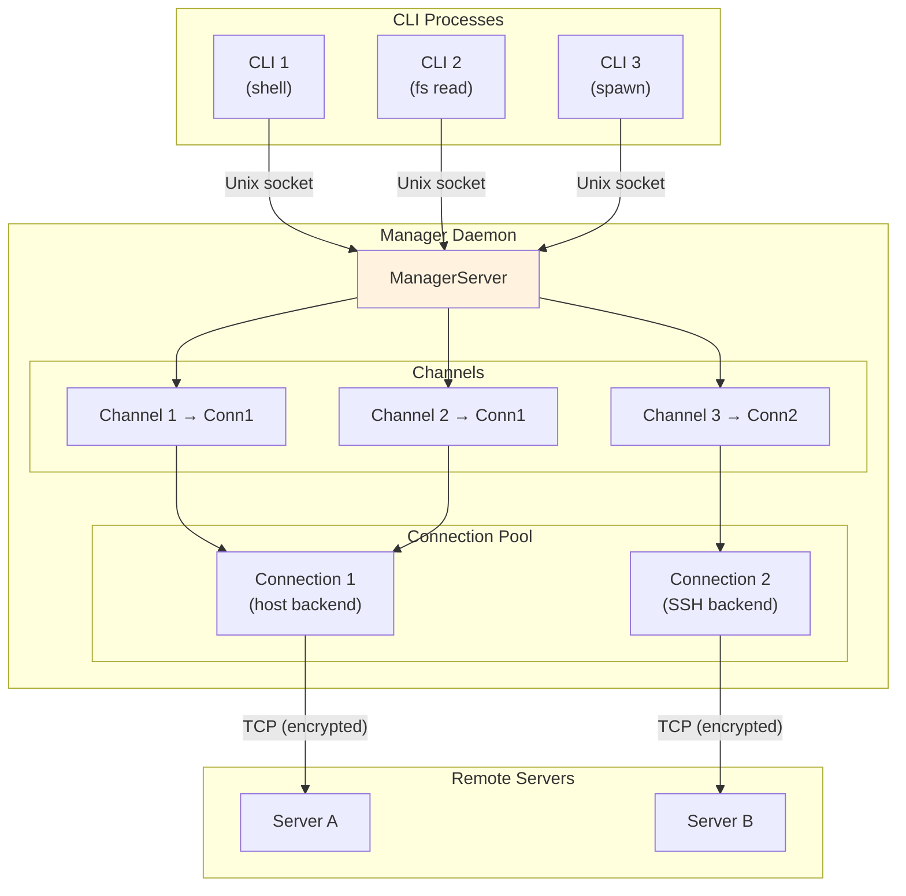

# distant — Architecture Guide

> Comprehensive reference for how distant works end-to-end, from CLI commands
> through the manager/server infrastructure, protocol, transports,
> authentication, plugins, and test harness.

---

## Table of Contents

1. [Introduction & Crate Map](#1-introduction--crate-map)
2. [High-Level Architecture](#2-high-level-architecture)
3. [Connection Lifecycle](#3-connection-lifecycle)
4. [Transport Layer](#4-transport-layer)
5. [Authentication](#5-authentication)
6. [Protocol](#6-protocol)
7. [Plugin System](#7-plugin-system)
8. [The Api Trait & Backend Implementations](#8-the-api-trait--backend-implementations)
9. [Manager Architecture](#9-manager-architecture)
10. [CLI Command Tree](#10-cli-command-tree)
11. [Test Harness](#11-test-harness-distant-test-harness)
12. [Key Type Reference](#12-key-type-reference)

---

## 1. Introduction & Crate Map

**distant** is a CLI tool and library for operating on remote computers through
file and process manipulation. It uses a client-server architecture where a
persistent **manager** daemon multiplexes connections to one or more **servers**
running on remote (or local) machines, with pluggable backends for SSH, Docker,
and native host access.

### Workspace Crates

| Crate | Description | Role |
|-------|-------------|------|
| `distant` | Binary CLI application | Entry point, command dispatch, terminal UI |
| `distant-core` | Core library | Protocol, transport, auth, manager, server, client, plugin trait |
| `distant-host` | Host backend plugin | Native OS operations via tokio::fs, notify, portable-pty |
| `distant-ssh` | SSH backend plugin | Remote operations via russh SFTP/exec channels |
| `distant-docker` | Docker backend plugin | Container operations via bollard Docker API |
| `distant-test-harness` | Test infrastructure | Fixtures, process management, cross-platform utilities |

### Crate Dependency Graph



---

## 2. High-Level Architecture

distant uses a three-tier model: **CLI** → **Manager** → **Server**.



**How it works:**

- The **Manager** is a long-lived daemon that listens on a Unix socket (or
  Windows named pipe) for local IPC.
- Multiple **CLI** invocations connect to the same manager, sharing server
  connections through multiplexed channels.
- Each **Server** connection is established through a **Plugin** (host, SSH, or
  Docker) that handles backend-specific setup and authentication.
- All CLI↔Manager communication uses the **Manager protocol**
  (`ManagerRequest`/`ManagerResponse`).
- All Manager↔Server communication uses the **distant protocol**
  (`Request`/`Response`) over an encrypted TCP transport.

---

## 3. Connection Lifecycle

A connection goes through three phases: **codec derivation** (handshake),
**authentication**, and **request/response**.



### Reconnection with OTP

After the initial connection, both sides store a one-time password (OTP)
derived from a second key exchange. If the TCP connection drops:



### Reconnect Strategies

Plugins configure how clients handle disconnections:

| Strategy | Behavior |
|----------|----------|
| `Fail` | No reconnection (default) |
| `ExponentialBackoff` | Doubling delay with configurable base, factor, max duration, max retries |
| `FibonacciBackoff` | Fibonacci-sequence delays |
| `FixedInterval` | Constant delay between retries |

The `HostPlugin` uses `ExponentialBackoff` by default; `SshPlugin` and
`DockerPlugin` use `Fail`.

---

## 4. Transport Layer

The transport layer is built in stacked layers, from raw I/O up to typed
protocol messages.



### Transport Trait

```rust
pub trait Transport: Reconnectable + fmt::Debug + Send + Sync {
    fn try_read(&self, buf: &mut [u8]) -> io::Result<usize>;
    fn try_write(&self, buf: &[u8]) -> io::Result<usize>;
    fn ready(&self, interest: Interest) -> Pin<Box<dyn Future<Output = io::Result<Ready>> + Send>>;
}

pub trait Reconnectable {
    fn reconnect(&mut self) -> Pin<Box<dyn Future<Output = io::Result<()>> + Send>>;
}
```

### Transport Implementations

| Implementation | Wraps | Platform | Reconnect |
|----------------|-------|----------|-----------|
| `TcpTransport` | `tokio::net::TcpStream` | All | Re-connects to stored addr:port |
| `UnixSocketTransport` | `tokio::net::UnixStream` | Unix | Re-connects to stored path |
| `WindowsPipeTransport` | `NamedPipe` | Windows | Client reconnects; Server unsupported |
| `InmemoryTransport` | `mpsc` channels | All (testing) | Returns `ConnectionRefused` |

### Codec Chain

```rust
pub trait Codec: DynClone {
    fn encode<'a>(&mut self, frame: Frame<'a>) -> io::Result<Frame<'a>>;
    fn decode<'a>(&mut self, frame: Frame<'a>) -> io::Result<Frame<'a>>;
}
```

| Codec | Purpose |
|-------|---------|
| `PlainCodec` | Identity / no-op (used during handshake) |
| `EncryptionCodec` | XChaCha20-Poly1305 AEAD (24-byte nonce prepended) |
| `CompressionCodec` | Deflate, Gzip, or Zlib via `flate2` |
| `ChainCodec<A, B>` | Composes two codecs: encode = A→B, decode = B→A |
| `PredicateCodec` | Conditionally applies a codec |

### Key Exchange



### Frame Format

Every frame on the wire has an 8-byte big-endian length header followed by the
payload:

```
+--------+--------+--------+--------+--------+--------+--------+--------+----------//----------+
|                          u64 length (big-endian)                      |     payload bytes     |
+--------+--------+--------+--------+--------+--------+--------+--------+----------//----------+
```

The `FramedTransport` maintains a `Backup` buffer (max 256 MiB, FIFO eviction)
of recently sent frames for replay during reconnection.

---

## 5. Authentication

After codec derivation, the server runs an authentication handshake using a
pluggable method system.



### Server Side

| Type | Role |
|------|------|
| `Verifier` | Holds a `HashMap<&str, Box<dyn AuthenticationMethod>>` |
| `AuthenticationMethod` | Trait: `id() -> &str`, `authenticate(&mut dyn Authenticator)` |
| `Authenticator` | Trait on transport: `initialize()`, `challenge()`, `verify()`, `info()`, `error()` |

**Built-in methods:**

| Method | ID | Behavior |
|--------|----|----------|
| `NoneAuthenticationMethod` | `"none"` | Always succeeds |
| `StaticKeyAuthenticationMethod` | `"static_key"` | Challenges for a key, compares against stored value |

### Client Side

| Type | Role |
|------|------|
| `AuthHandler` | Trait: `on_initialization()`, `on_start_method()`, `on_finished()` |
| `AuthMethodHandler` | Trait: `on_challenge()`, `on_verification()`, `on_info()`, `on_error()` |

**Built-in handlers (distant-core):** `DummyAuthHandler` (fails all
challenges), `SingleAuthHandler` (delegates to a single `AuthMethodHandler`),
`AuthHandlerMap` (routes methods to handlers by name).

**Method handlers (distant-core):** `PromptAuthMethodHandler` (interactive
prompt), `StaticKeyAuthMethodHandler` (pre-configured key).

**CLI handlers (binary crate):** `PromptAuthHandler` (terminal prompts),
`JsonAuthHandler` (JSON-lines protocol).

### Sensitive Data

`SecretString` wraps sensitive values (keys, passwords) — redacted in
`Debug`/`Display`, requires explicit `.as_exposed()` to access the inner value.

---

## 6. Protocol

The distant protocol defines two layers: the **server protocol** for
remote operations and the **manager protocol** for connection management.

### Serialization

- **Wire format:** MessagePack via `rmp-serde` (`to_vec_named` / `from_slice`)
- **JSON support:** Used for external plugin communication and debugging
- **Serde tags:** `#[serde(rename_all = "snake_case", tag = "type")]` — JSON
  uses a tagged union format

### Msg Wrapper

```rust
pub enum Msg<T> {
    Single(T),
    Batch(Vec<T>),
}
```

Wraps either a single request/response or a batch. Serialized with
`#[serde(untagged)]`.

### Request Enum (24 variants)

| Domain | Variants |
|--------|----------|
| **File I/O** | `FileRead`, `FileReadText`, `FileWrite`, `FileWriteText`, `FileAppend`, `FileAppendText` |
| **Directory** | `DirRead` (with depth, absolute, canonicalize, include_root), `DirCreate` (with all) |
| **Filesystem** | `Copy`, `Remove`, `Rename`, `Exists`, `Metadata`, `SetPermissions` |
| **Watch** | `Watch` (recursive, only, except filters), `Unwatch` |
| **Search** | `Search` (query), `CancelSearch` |
| **Process** | `ProcSpawn` (cmd, env, cwd, pty), `ProcKill`, `ProcStdin`, `ProcResizePty` |
| **System** | `SystemInfo`, `Version` |

### Response Enum (17 variants)

| Category | Variants |
|----------|----------|
| **Generic** | `Ok`, `Error(Error)`, `Blob { data }`, `Text { data }` |
| **Filesystem** | `DirEntries`, `Changed(Change)`, `Exists { value }`, `Metadata`, `SystemInfo`, `Version` |
| **Search** | `SearchStarted { id }`, `SearchResults { id, matches }`, `SearchDone { id }` |
| **Process** | `ProcSpawned { id }`, `ProcStdout { id, data }`, `ProcStderr { id, data }`, `ProcDone { id, success, code }` |

Process and search responses are **streaming** — the server sends multiple
`ProcStdout`/`ProcStderr`/`SearchResults` responses for a single request,
terminated by `ProcDone`/`SearchDone`.

### Request/Response Wrappers

```rust
pub struct Request<T> {
    pub header: Header,  // optional metadata (skipped when empty)
    pub id: Id,          // Id = String
    pub payload: T,
}
pub struct Response<T> {
    pub header: Header,
    pub id: Id,
    pub payload: T,
}
```

`UntypedRequest`/`UntypedResponse` carry a parsed `Header` as raw bytes and
the payload as raw bytes, enabling efficient forwarding through the manager
without full deserialization of the payload.

### Manager Protocol

A separate request/response layer for managing connections:

**ManagerRequest** (10 variants):

| Variant | Purpose |
|---------|---------|
| `Version` | Manager version |
| `Launch { destination, options }` | Launch a server via plugin |
| `Connect { destination, options }` | Connect to existing server via plugin |
| `Authenticate { id, msg }` | Relay auth response during connect/launch |
| `OpenChannel { id }` | Open multiplexed channel on a connection |
| `Channel { id, request }` | Forward request through a channel |
| `CloseChannel { id }` | Close a channel |
| `Info { id }` | Connection info |
| `Kill { id }` | Kill a connection |
| `List` | List all connections |

**ManagerResponse** (11 variants):

| Variant | Purpose |
|---------|---------|
| `Version { version }` | Manager version (SemVer) |
| `Launched { destination }` | Server launched, destination returned |
| `Connected { id }` | Connection established |
| `Authenticate { id, msg }` | Auth challenge relay to client |
| `ChannelOpened { id }` | Channel ready |
| `Channel { id, response }` | Forwarded response |
| `ChannelClosed { id }` | Channel closed |
| `Info(ConnectionInfo)` | Connection details |
| `List(ConnectionList)` | All connections |
| `Killed` | Connection terminated |
| `Error { description }` | Error |

### Protocol Versioning

```rust
pub const PROTOCOL_VERSION: Version  // derived from crate version at compile time
```

`Version` (in `net::common`) wraps a `semver::Version` with lower/upper
`Comparator` bounds for compatibility checking:

- Pre-1.0 (major = 0): `>=0.minor.patch, <0.(minor+1).0`
- Post-1.0: `>=major.minor.patch, <(major+1).0.0`
- Patch differences within range are always compatible

---

## 7. Plugin System

Plugins are the bridge between the manager and backend-specific connection
logic. The manager routes requests by extracting the URI scheme from the
destination and looking up the corresponding plugin.



### Plugin Trait

```rust
pub trait Plugin: Send + Sync {
    fn name(&self) -> &str;
    fn schemes(&self) -> Vec<String> { vec![self.name().to_string()] }

    fn connect(&self, raw_destination: &str, options: &Map,
        authenticator: &mut dyn Authenticator)
        -> Pin<Box<dyn Future<Output = io::Result<UntypedClient>> + Send>>;

    fn launch(&self, raw_destination: &str, options: &Map,
        authenticator: &mut dyn Authenticator)
        -> Pin<Box<dyn Future<Output = io::Result<Destination>> + Send>>;
        // default: returns Unsupported error
}
```

Plugins receive **raw destination strings** (not parsed `Destination`) so
backends with non-standard URI formats (e.g., `docker://ubuntu:22.04`) can do
their own parsing.

### Built-in Plugins

| Plugin | Scheme | `connect()` | `launch()` |
|--------|--------|-------------|------------|
| `HostPlugin` | `distant` | TCP connect to existing server, static key auth | Spawn local `distant server listen`, read credentials from stdout |
| `SshPlugin` | `ssh` | SSH connect → in-memory server with `SshApi` | SSH connect → run `distant server listen --daemon` on remote |
| `DockerPlugin` | `docker` | Docker API connect → in-memory server with `DockerApi` | Create container (`sleep infinity`) → in-memory server |

### External Plugin Binary Protocol

`ProcessPlugin` wraps an external binary using JSON-lines over stdin/stdout:

**Connect flow** (`<binary> connect <destination> [--key=value ...]`):
1. Spawn child process with piped stdio
2. **Setup phase** (120s timeout): relay auth challenges
   - Child sends: `{"auth_challenge": {"questions": [...], "options": {...}}}`
   - Parent responds: `{"auth_response": {"answers": [...]}}`
   - Repeat until child sends: `{"ready": true}`
3. **Data phase**: stdin/stdout become bidirectional transport

**Launch flow** (`<binary> launch <destination> [--key=value ...]`):
1. Same spawn + auth relay
2. Child sends: `{"destination": "scheme://host:port"}` instead of `{"ready": true}`
3. Child exits after emitting destination

**Error format:** `{"error": {"kind": "not_found|permission_denied|...", "description": "..."}}`

---

## 8. The Api Trait & Backend Implementations

### Api Trait

The `Api` trait is the server-side contract. All 22+ methods default to
returning "unsupported", so backends only implement what they support.

```rust
pub trait Api {
    // Lifecycle (default: Ok(()))
    fn on_connect(&self, id: ConnectionId) -> impl Future<Output = io::Result<()>>;
    fn on_disconnect(&self, id: ConnectionId) -> impl Future<Output = io::Result<()>>;

    // File I/O (default: unsupported)
    fn read_file(&self, ctx: Ctx, path: RemotePath) -> impl Future<Output = io::Result<Vec<u8>>>;
    fn write_file(&self, ctx: Ctx, path: RemotePath, data: Vec<u8>) -> impl Future<Output = io::Result<()>>;
    // ... (26 methods total: 2 lifecycle + 24 operations covering files, dirs, search, process, system)

    // System
    fn version(&self, ctx: Ctx) -> impl Future<Output = io::Result<Version>>;
    fn system_info(&self, ctx: Ctx) -> impl Future<Output = io::Result<SystemInfo>>;
}
```

> **Note:** The trait itself has no supertrait bounds. `Send + Sync + 'static`
> is required by `ApiServerHandler<T: Api>` when bridging to `ServerHandler`.
```

`ApiServerHandler<T: Api>` bridges any `Api` impl into a `ServerHandler` by
dispatching each `Request` variant to the corresponding trait method.

### Backend Architecture Pattern

All three backends follow the same pattern for `Plugin::connect()`:


The plugin creates an `Api` implementation, wraps it in
`ApiServerHandler`, starts a `Server` with `Verifier::none()` connected
via an `InmemoryTransport::pair(100)`, and returns the client end.

### Backend Comparison

| Capability | distant-host | distant-ssh | distant-docker |
|-----------|--------------|-------------|----------------|
| **File I/O** | `tokio::fs` (direct) | SFTP via `russh_sftp` | tar archives via Docker API (`download_from_container` / `upload_to_container`) |
| **Directory ops** | `tokio::fs` + `walkdir` | SFTP mkdir/readdir | `mkdir -p` via exec + tar archives |
| **Process spawn** | `portable-pty` (PTY) or `tokio::process` | SSH exec channels | Docker exec API (`create_exec` + `start_exec`) |
| **File watch** | `notify` crate (native + poll modes) | Not supported | Not supported |
| **Search** | `ignore::WalkBuilder` + `grep` crate | Not supported | Probes for `rg`/`grep`/`find` in container |
| **Copy** | `tokio::fs::copy` + `walkdir` | SFTP recursive | tar upload |
| **Path handling** | Native `PathBuf` | `SftpPathBuf` (Unix/Windows format conversion) | Container paths (always Unix) |

### distant-host Details

- **State:** `GlobalState` holds `ProcessState`, `SearchState`, `WatcherState`
- **Process:** `Process` trait with `pty` (portable-pty) and `simple`
  (tokio::process) variants
- **Watch:** Native filesystem events via `notify`, with recursive/filter support
- **Search:** Respects `.gitignore` via `ignore::WalkBuilder`

### distant-ssh Details

- **Two-phase lifecycle:** `SshSession` (unauthenticated) →
  `AuthResult::Authenticated(Ssh)` (authenticated)
- **`ChannelPool`:** Manages SSH channel allocation. Caches a single SFTP session.
  When `MaxSessions` is hit, reactively evicts the SFTP session to free a
  channel slot. For `MaxSessions > 1`, SFTP is never evicted.
- **Timeouts:** Always uses `SftpSession::new_opts()` with the crate's unified
  `SSH_TIMEOUT_SECS` constant (never the russh-sftp 10s default).
- **Config resolution:** Reads `~/.ssh/config` for hostname, port, user, identity
  files, ProxyCommand, certificate paths.

### distant-docker Details

- **Bollard:** `DockerClient` wraps `bollard::Docker` for all container operations
- **Tar archive I/O:** Even single-file reads/writes go through tar archives —
  this works in distroless/scratch containers with no shell
- **Search tool probing:** `probe_search_tools()` runs `which rg`, `which grep`,
  `which find` at init. The `version()` response only advertises search
  capability if tools are available.
- **Container lifecycle:** `Docker::launch()` creates containers named
  `distant-<hex>` with `sleep infinity` entrypoint. Containers are
  auto-removed on server shutdown if configured.

---

## 9. Manager Architecture

The manager is a connection multiplexer that allows multiple CLI processes to
share backend connections.



### ManagerServer

```rust
pub struct ManagerServer {
    config: Config,
    channels: RwLock<HashMap<ManagerChannelId, ManagerChannel>>,
    connections: RwLock<HashMap<ConnectionId, ManagerConnection>>,
    registry: Arc<RwLock<HashMap<ManagerAuthenticationId, oneshot::Sender<AuthenticationResponse>>>>,
}
```

Implements `ServerHandler<Request = ManagerRequest, Response = ManagerResponse>`.

### Manager Config

```rust
pub struct Config {
    pub launch_fallback_scheme: String,      // default: "ssh"
    pub connect_fallback_scheme: String,     // default: "distant"
    pub connection_buffer_size: usize,       // default: 100
    pub user: bool,
    pub plugins: HashMap<String, Arc<dyn Plugin>>,
}
```

When a destination has no explicit scheme, the manager falls back to
`launch_fallback_scheme` (for `launch`) or `connect_fallback_scheme`
(for `connect`).

### Channel Multiplexing

Each connection can have multiple channels opened via `ManagerRequest::OpenChannel`.
Channels forward `UntypedRequest`/`UntypedResponse` to/from the backing server
connection using zero-copy packet forwarding via `Header` + raw payload bytes.

### ManagerClient

`ManagerClient` is a typed `Client<ManagerRequest, ManagerResponse>` with
high-level methods: `launch()`, `connect()`, `open_raw_channel()`, `version()`,
`info()`, `kill()`, `list()`.

The `launch()` and `connect()` methods handle the authentication relay loop
inline — they process `ManagerResponse::Authenticate` messages by forwarding
challenges to the provided `AuthHandler` and sending responses back.

---

## 10. CLI Command Tree

```
distant
├── connect <destination>          # Connect to server via manager
├── launch <destination>           # Launch distant server via plugin
├── shell [connection_id]          # Interactive remote shell (PTY)
├── spawn <cmd> [args...]          # Run remote command (optional PTY/LSP)
├── copy <src> <dst>               # Local↔remote file transfer
├── ssh <destination>              # SSH connect + open shell (feature=ssh)
├── api [connection_id]            # JSON-lines API over stdin/stdout
├── fs                             # File system operations
│   ├── copy <src> <dst>
│   ├── exists <path>
│   ├── make-dir <path>
│   ├── metadata <path>
│   ├── read <path>
│   ├── remove <path>
│   ├── rename <src> <dst>
│   ├── search <query>
│   ├── set-permissions <path>
│   ├── watch <path>
│   └── write <path>
├── system-info [connection_id]    # Remote system info
├── version [connection_id]        # Remote server version
├── status [connection_id]         # Manager/connection status
├── kill [connection_id]           # Kill a connection
├── select [connection_id]         # Select active connection
├── manager
│   ├── listen                     # Start manager daemon
│   ├── version                    # Manager version
│   └── service                    # OS service management
│       ├── start
│       ├── stop
│       ├── install
│       └── uninstall
├── server                         # (feature=host)
│   └── listen                     # Start distant server
└── generate
    ├── config                     # Generate config file
    └── completion <shell>         # Shell completions
```

### Command → Protocol Mapping

| Command | Manager Request | Server Request |
|---------|-----------------|----------------|
| `distant launch <dest>` | `Launch { destination }` | — |
| `distant connect <dest>` | `Connect { destination }` | — |
| `distant shell` | `OpenChannel` | `ProcSpawn { pty: Some(...) }` |
| `distant spawn <cmd>` | `OpenChannel` | `ProcSpawn { cmd }` |
| `distant fs read <path>` | `Channel { request }` | `FileRead { path }` |
| `distant fs watch <path>` | `Channel { request }` | `Watch { path }` |
| `distant system-info` | `Channel { request }` | `SystemInfo {}` |

### Shell Session with Predictive Echo

The `shell` command provides an interactive terminal with Mosh-style
predictive local echo to mask network latency:

| Component | Purpose |
|-----------|---------|
| `TerminalSession` | Orchestrates raw mode, input forwarding, framebuffer |
| `TerminalFramebuffer` | Shadow screen via `vt100::Parser`, prediction overlay |
| `PredictionOverlay` | Tracks predicted characters with epoch/expiry (2s) |
| `RttEstimator` | Jacobson/Karels SRTT tracking (initial 100ms) |
| `TerminalSanitizer` | Strips ConPTY, mouse tracking, terminal query sequences |

**Prediction modes:**

| Mode | Behavior |
|------|----------|
| `Off` | Never predict |
| `Adaptive` | Predict when SRTT > 30ms (default) |
| `On` | Always predict |
| `Fast` | Always predict, skip epoch confirmation |
| `FastAdaptive` | Adaptive activation, skip epoch confirmation |

At high latency (SRTT > 80ms), predictions are rendered with underline to
indicate unconfirmed input. Bulk paste (>100 bytes within 10ms) disables
prediction temporarily.

---

## 11. Test Harness (`distant-test-harness`)

The test harness provides four patterns for testing at different levels of
integration.

```mermaid
flowchart TB
    subgraph "Pattern 1: In-Process (ClientCtx)"
        P1_Client["Client"]
        P1_Server["Server<br/>(ApiServerHandler&lt;host::Api&gt;)"]
        P1_Transport["TCP on 127.0.0.1:0"]
        P1_Client <-->|"TCP"| P1_Transport
        P1_Transport <--> P1_Server
    end

    subgraph "Pattern 2: Full CLI (ManagerCtx)"
        P2_Test["Test Process"]
        P2_Manager["distant manager listen<br/>(child process)"]
        P2_Server["distant server listen<br/>(child process)"]
        P2_Test <-->|"Unix socket"| P2_Manager
        P2_Manager <-->|"TCP"| P2_Server
    end

    subgraph "Pattern 3: SSH (Sshd fixture)"
        P3_Client["Client / Ssh"]
        P3_Sshd["sshd<br/>(per-test instance)"]
        P3_Client <-->|"SSH"| P3_Sshd
    end

    subgraph "Pattern 4: Docker"
        P4_Client["Client / DockerManagerCtx"]
        P4_Container["ubuntu:22.04<br/>(per-test container)"]
        P4_Client <-->|"Docker API"| P4_Container
    end

    style P1_Transport fill:#e1f5fe
    style P2_Manager fill:#fff3e0
    style P3_Sshd fill:#e8f5e9
    style P4_Container fill:#f3e5f5
```



### Pattern 1: In-Process (`ClientCtx`)

- **Fixture:** `host::ctx()` (rstest async fixture)
- **How:** Spawns `Server<ApiServerHandler<host::Api>>` on `127.0.0.1:0` in a
  tokio task, creates `Client` with `DummyAuthHandler` and `TcpConnector`
- **Scope:** API-level tests without CLI or subprocess overhead
- **Cleanup:** `_done_tx` channel drop signals server shutdown

### Pattern 2: Full CLI (`ManagerCtx`)

- **Fixtures:** `manager::ctx()` (auto-connects), `manager_only_ctx()` (no
  auto-connect, exposes credentials)
- **How:** Spawns real `distant manager listen` + `distant server listen` as
  child processes, parses credentials from server stdout via
  `Credentials::find()`, connects through the manager
- **IPC:** Unix socket (`distant_test_{random}.sock`) or Windows named pipe
- **Retry:** 3 attempts with 250ms pause, tries IPv4/IPv6/localhost
- **Cleanup:** `Drop` calls `kill_process_tree()` on both processes
- **Also provides:** `ApiProcess` for testing the `distant api` JSON protocol

### Pattern 3: SSH Integration (`Sshd` fixture)

- **Fixtures:** `sshd::client()` → `Ctx<Client>`, `sshd::ssh()` → `Ctx<Ssh>`
- **How:** Generates ed25519 keys in `TempDir`, writes `sshd_config`, spawns
  system `sshd` in foreground mode. Uses direct key file loading (no
  ssh-agent).
- **Port allocation:** Tries up to 100 ports in range 49152–65535 with
  hash-based random start to reduce contention across nextest workers
- **Spawn retry:** 3 attempts with 300ms wait and alive checks between
- **`Ctx<T>` pattern:** Generic wrapper — `#[deref]` on `value: T`, keeps
  `sshd: Sshd` alive for the test duration

### Pattern 4: Docker Integration

- **Fixtures:** `docker::client()` → `Option<Ctx<Client>>`,
  `docker::docker_ctx()` → `Option<DockerManagerCtx>>`
- **How:** Creates `ubuntu:22.04` container named `distant-test-{hex}` with
  `sleep infinity`, auto-removes on drop
- **Guard:** `docker_available()` checks `DockerClient::connect_default()` +
  `ping()` + `is_linux_engine()`; `skip_if_no_docker!` macro for graceful skip
- **DockerManagerCtx:** Spawns real `distant manager listen`, then
  `distant connect docker://{container}` for full-stack testing

### Cross-Platform Utilities

| Utility | Purpose |
|---------|---------|
| `kill_process_tree(child)` | Unix: SIGKILL descendants deepest-first + process group; Windows: `taskkill /T /F` |
| `set_process_group(cmd)` | Unix: `cmd.process_group(0)`; Windows: no-op |
| `normalize_path(path)` | Windows: resolves 8.3 short names via `GetLongPathNameW`; Unix: identity |
| `ThreadedReader` | Non-blocking line reader with configurable timeout (default 250ms) |
| Script statics | Cross-platform `ECHO_ARGS_TO_STDOUT`, `EXIT_CODE`, `SLEEP`, etc. (.sh / .cmd) |

### CI Throttling (nextest)

| Test Group | Max Threads | Filter |
|------------|-------------|--------|
| `ssh-integration` | 4 | `binary_id(distant-ssh::lib)` |
| `ssh-integration-windows` | 1 | Same + `cfg(target_os = "windows")` |
| `docker-integration` | 2 | `binary_id(distant-docker::lib)` |

CI profile uses exponential backoff retries (count=4, delay=1s, max=16s,
jitter=true) with 60s slow-timeout.

---

## 12. Key Type Reference

### Core Traits and Implementors

| Trait | Implementors |
|-------|-------------|
| `Api` | `distant_host::Api`, `distant_ssh::SshApi`, `distant_docker::DockerApi` |
| `Plugin` | `HostPlugin` (`"distant"`), `SshPlugin` (`"ssh"`), `DockerPlugin` (`"docker"`), `ProcessPlugin` (custom) |
| `Transport` | `TcpTransport`, `UnixSocketTransport`, `WindowsPipeTransport`, `InmemoryTransport` |
| `Codec` | `PlainCodec`, `EncryptionCodec`, `CompressionCodec`, `ChainCodec<A,B>`, `PredicateCodec` |
| `ServerHandler` | `ApiServerHandler<T: Api>`, `ManagerServer` |
| `AuthenticationMethod` | `NoneAuthenticationMethod`, `StaticKeyAuthenticationMethod` |
| `AuthHandler` | `DummyAuthHandler`, `SingleAuthHandler`, `AuthHandlerMap` (core); `PromptAuthHandler`, `JsonAuthHandler` (CLI) |
| `Reconnectable` | All `Transport` implementations |

### Key Type Aliases

| Alias | Expands To |
|-------|-----------|
| `Client` | `net::Client<Msg<Request>, Msg<Response>>` |
| `Channel` | `net::client::Channel<Msg<Request>, Msg<Response>>` |
| `Handler` (distant-host) | `ApiServerHandler<host::Api>` |
| `ManagerClient` | `Client<ManagerRequest, ManagerResponse>` |
| `ManagerChannelId` | `u32` |
| `ConnectionId` | `u32` |
| `ProcessId` | `u32` |
| `SearchId` | `u32` |
| `BoxedCodec` | `Box<dyn Codec + Send + Sync>` |
| `SecretKey32` | 32-byte key wrapper |

### Configuration Defaults

| Config | Field | Default |
|--------|-------|---------|
| `ServerConfig` | `connection_sleep` | 1ms |
| `ServerConfig` | `connection_heartbeat` | 5s |
| `ServerConfig` | `shutdown` | `Never` |
| `ClientConfig` | `reconnect_strategy` | `Fail` |
| `ClientConfig` | `silence_duration` | 20s |
| Manager `Config` | `launch_fallback_scheme` | `"ssh"` |
| Manager `Config` | `connect_fallback_scheme` | `"distant"` |
| Manager `Config` | `connection_buffer_size` | 100 |

### Frame/Buffer Constants

| Constant | Value |
|----------|-------|
| `Frame::HEADER_SIZE` | 8 bytes |
| `READ_BUF_SIZE` | 8192 bytes |
| `MAX_BACKUP_SIZE` | 256 MiB |
| `CLIENT_PIPE_CAPACITY` | 10,000 |
| `CLIENT_WATCHER_CAPACITY` | 100 |
| `CLIENT_SEARCHER_CAPACITY` | 10,000 |
